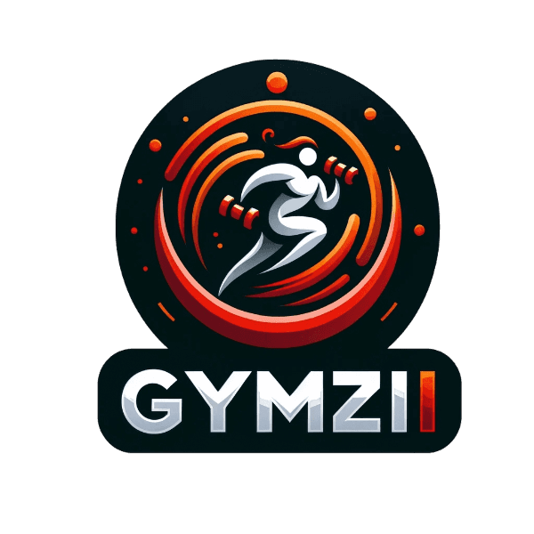

# GymWebAbp GYMZII

# Komanda NUSIPRAUSĘ ir jos nariai:
Kauno technologijos universiteto Informatikos fakulteto „Programų sistemos” studijų programos grupės IFF-2/1 studentai:
* Rokas Gudžiūnas,
* Gedmantas Šilinskas,
* Rugilė Jovaišaitė,
* Simona Gerikaitė.
# Techninė užduotis
Užduotis buvo sukurti internetinį puslapį skirtą sportu užsiimantiems žmonėms, kuriame vartotojai galėtų sekti savo progresą, pasirinkdami kokia sporto šaka užsiima. Programėlėje yra interaktyvus kūno anatomijos žemėlapis, kuriame vartotojai gali spustelėti tam tikrą raumenų grupę ir gauti su ta raumenų grupe susijusius pratimus. Be to, yra įdiegta vartotojų tarpusavio bendravimo funkcija, leidžianti jiems bendrauti vienam su kitu.
# Pagrindinė problematika
Daugelis šiuolaikinių programėlių ar puslapių, skirtų progreso sporte sekimui, reikalauja tam tikro papildomo mokesčio, jog vartotojas galėtų naudotis jų teikiamomis paslaugomis. Mes taip pat buvome susidūrę su šia problema ir supratome, jog toks mokestis dideliai daliai žmonių sukelia nepatogumų ir priverčia ieškoti kitokių asmeninio tobulėjimo sekimo alternatyvų. Padarėme išvadą, jog yra didelis poreikis tokio tipo nemokamai paslaugai ir sukūrėme papildomo mokesčio neprašančią progreso sekimo sporte internetinį puslapį.
# Architektūra
