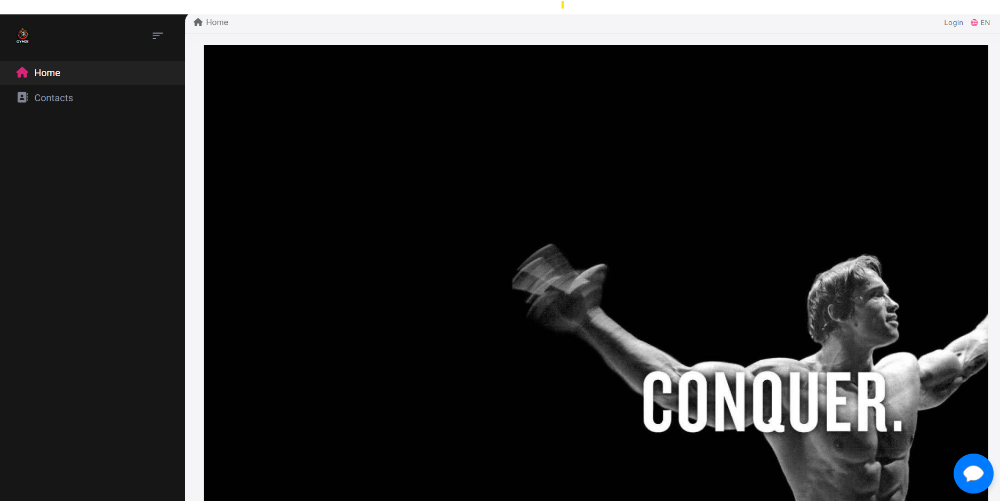
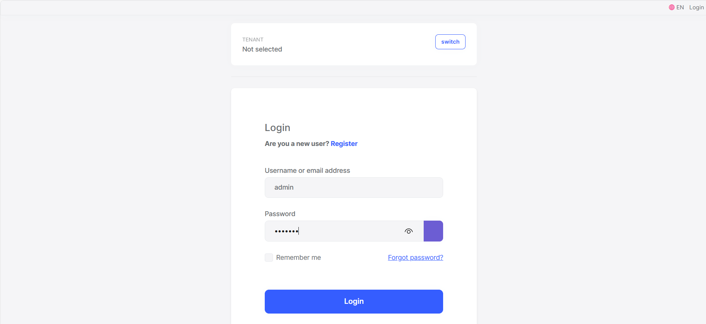
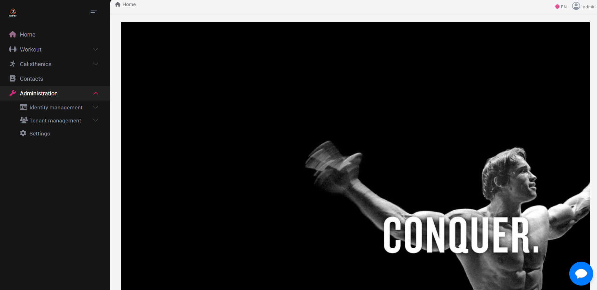
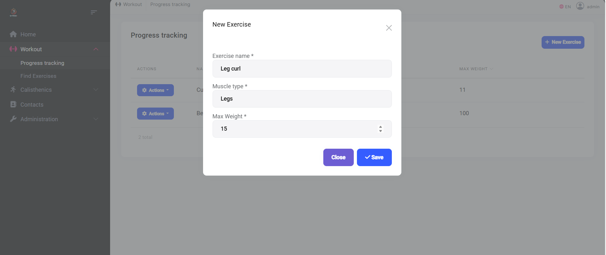
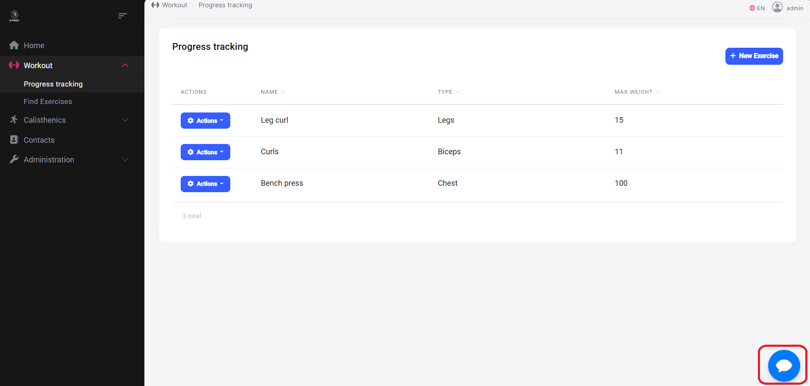
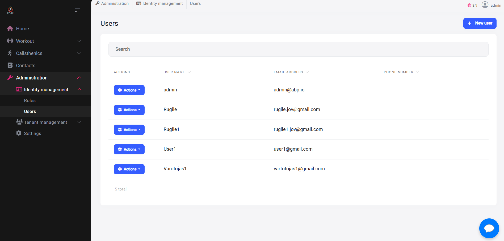

# GymWebAbp GYMZII

## Komanda NUSIPRAUSĘ ir jos nariai:
Kauno technologijos universiteto Informatikos fakulteto „Programų sistemos” studijų programos grupės IFF-2/1 studentai:
* Rokas Gudžiūnas,
* Gedmantas Šilinskas,
* Rugilė Jovaišaitė,
* Simona Gerikaitė.
## Techninė užduotis
Užduotis buvo sukurti internetinį puslapį skirtą sportu užsiimantiems žmonėms, kuriame vartotojai galėtų sekti savo progresą, pasirinkdami kokia sporto šaka užsiima. Programėlėje yra interaktyvus kūno anatomijos žemėlapis, kuriame vartotojai gali spustelėti tam tikrą raumenų grupę ir gauti su ta raumenų grupe susijusius pratimus. Be to, yra įdiegta vartotojų tarpusavio bendravimo funkcija, leidžianti jiems bendrauti vienam su kitu.
## Pagrindinė problematika
Daugelis šiuolaikinių programėlių ar puslapių, skirtų progreso sporte sekimui, reikalauja tam tikro papildomo mokesčio, jog vartotojas galėtų naudotis jų teikiamomis paslaugomis. Mes taip pat buvome susidūrę su šia problema ir supratome, jog toks mokestis dideliai daliai žmonių sukelia nepatogumų ir priverčia ieškoti kitokių asmeninio tobulėjimo sekimo alternatyvų. Padarėme išvadą, jog yra didelis poreikis tokio tipo nemokamai paslaugai ir sukūrėme papildomo mokesčio neprašančią progreso sekimo sporte internetinį puslapį.
## Architektūra

## Testavimas
Statinė kodo analizė, vienetų testai ir našumo testai ir jų rezultatai yra pateikti [čia](Testavimas)
## Lokalus puslapio paleidimas
Prieš pradėdami, įsitikinkite, kad jūsų sistema atitinka šiuos reikalavimus:

- [Node.js](https://nodejs.org/) (versija 12 arba naujesnė)
- [Angular CLI](https://angular.io/cli) (versija 10 arba naujesnė)
- [Visual Studio 2019](https://visualstudio.microsoft.com/vs/) arba naujesnė
- [Visual Studio Code](https://code.visualstudio.com/)
- .NET Core SDK (versija 3.1 arba naujesnė)

Sekite šiuos žingsnius norėdami įdiegti projektą:

Siekiant sklandžiai naudoti šią web aplikaciją, visų pirma reikia įsidiegti projekte naudojamas bibliotekas, atsidarius terminalą ir suvedus tokias komandas:
```sh
abp install-libs
```
arba
```sh
npm install
```

Atsidarę šį projektą, pasirinkite Gymzii.DbMigrator, kaip "Startup Project" bei jį paleiskite. Šitaip inicializuosite savo lokalią duomenų bazę.
Atlikę šiuos veiksmus, pasirinkite Gymzii.HttpApi.Host, kaip "Startup Project" bei jį paleiskite, šis veiksmas atvers "swagger" platformą, kurioje imituojamos jūsų kuriamos aplikacijų programavimo sąsajos (angl. application programming interface, API).

Norėdami pamatyti ir pakoreguoti naudotojo sąsają (angl. User Interface, UI), reikalinga VS Code programinė įranga arba projekto paleidimas, naudojant "Command Prompt" terminalą iš angular direktorijos. Abiem scenarijams naudojama komanda:
```sh
ng serve
```
Atlikę šiuos veiksmus, sėkmingai galėsite naudotis šioje repozitorijoje esančiu projektu.
## Naudotojo vadovas
1. Atidarykite internetinį puslapį. Turėtumėte matyti tokį vaizdą:

2. Spustelėkite viršutiniame dešiniajame kampe esantį "Login" mygtuką ir prisijunkite kaip administratorius, su šiais duomenimis.
* Username or email address: admin
* Password: 1q2w3E

Toks slaptažodis yra iš anksto numatytuose ABP nustatymuose.


Turėtumėte matyti tokį vaizdą:


3. Paspauskite kairėje veiksmų juostoje "Workout", išsiskleidusiame meniu pasirinkite "Progress tracking" ir sukurkite naują pratimą.


Pratimų maksimalų rezultatą galima atnaujinti: paspaudus edit ar sukūras naują tokį patį pratimą tik pakeitus jo "Max Weight" į didesnę reikšmę.

Panašiai veikia ir kitų sporto šakų, esančių kairėje juostoje, progreso atnaujimas.
Taip pat veikia ir susirašinėjimo su kitais vartotojais funkcija. Ja galima pasinaudoti spustelėjus ant dešiniame apatiniame kampe esančios ikonos.


4. Paspauskite kairėje veiksmų juostoje "Administration", išsiskleidusiame meniu pasirinkite "Identity management", tada "Users" ir ten galite pakeisti savo varotojų leidimus.



Atlikę šiuos veiksmus gebėsite suprasti pagrindinį šio internetinio puslapio funkcionalumą, perprasti sunkesnes funkcijas ir pridėti savas.

## Naudota dokumentacija
Geriausias būdas, kaip išmokti naudotis ABP, yra skaityti dokumentaciją oficialiame ABP [puslapyje](https://docs.abp.io/en/abp/latest/Tutorials/Todo/Single-Layer/Index?UI=NG&DB=EF).
